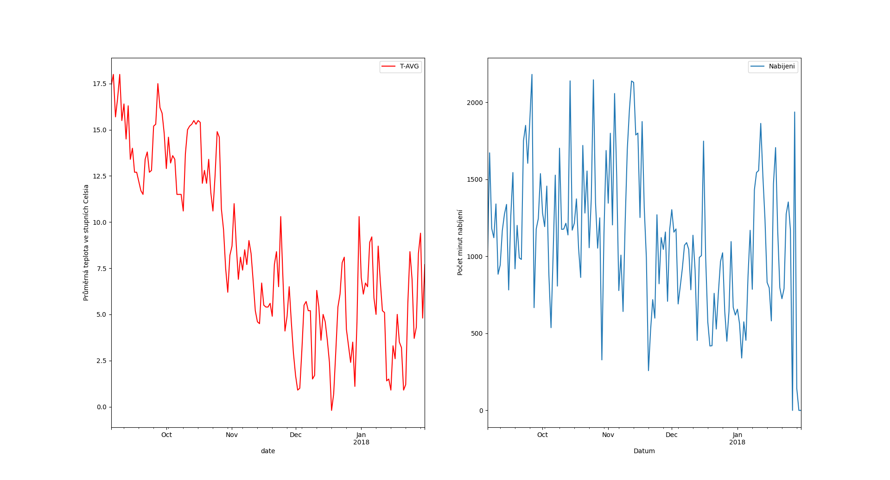
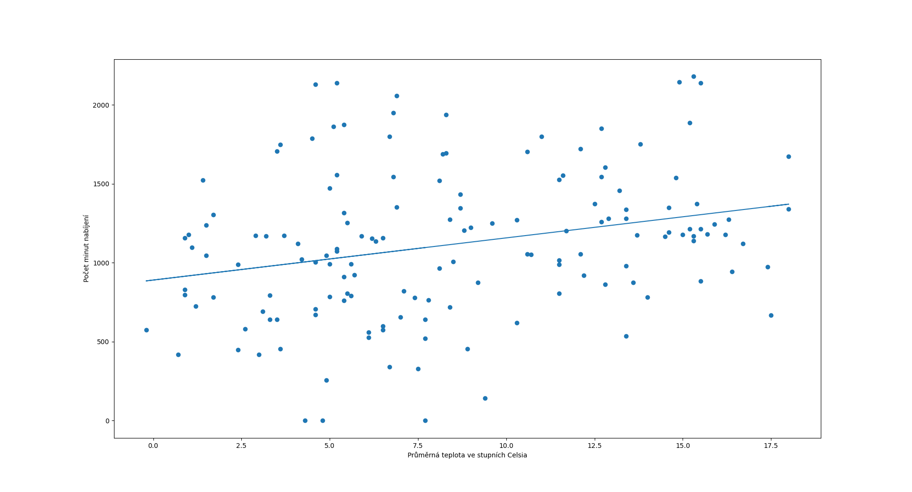

# Minuty nabíjení ze zásuvek u veřejných laviček a venkovní teplota
V roce 2017 se do ulic Prahy v rámci pilotního projektu dostalo několik chytrých laviček.
Tyto lavičky jednak umožňují např. zjišťovat aktuální teplotu nebo přivolat pomoc, ale také
na sobě mají USB porty, ze kterých si občané města mohou nabít telefon.

Operátor ICT, který lavičky provozuje, mezi 5.9.2017 a 31.1.2018 sbíral data o využívání USB portů,
konkrétně za každý den celkový počet minut nabíjení. Mým cílem je v rámci práce zjistit, zda
počet minut nabíjení koreluje s teplotou daný den v Praze.

Data o nabíjení jsem čerpal jednak z již zmíněného [datasetu Operátora ICT](https://opendata.praha.eu/dataset/lavicky-api-usb), konkrétně z CSV, které obsahuje celkový počet minut u laviček z Alšova nábřeží. Jako data o teplotě jsem použil [dataset z pražského Klementina](https://www.chmi.cz/historicka-data/pocasi/praha-klementinum). Data o teplotě byla ve formátu `.xlsx`, jeho převod na CSV jsem provedl pomocí nástroje `ssconvert`.

## Příprava dat
Oba datasety potřebují jen mírnou přípravu. CSV s lavičkami kupodivu obsahuje data už z období mezi 1.7.2017 a 5.9.2017, která jsou ale z velké části nulová.
Spolehl jsem se tedy na údaj uváděný na webové stránce datasetu, kde je jako začátek sběru dat uváděno 5.9.2017. Podle tohoto jsem ve skriptu oba datasety ořízl.  

## První náhled
Nejdříve si vykreslíme jak teploty, tak minuty nabíjení vedle sebe. Od oka to vypadá, že sledují podobný trend. Dávalo by to smysl; když je větší zima,
lidé chodí méně ven a méně se sluní na lavičkách.

## Lineární regrese
Následně pomocí lineární regrese zjistíme, zda průměrná teplota daného dne a počet minut nabíjení korelují.
Nulová hypotéza je taková, že oba datasety jsou nekorelované. Zvolíme hladinu významnosti 0.05. Následně provedeme lineární regresi, jejíž výsledek je vidět na obrázku.

Z lineární regrese dostáváme p-hodnotu rovnou přibližně 0.0008, což je pod naší hladinou významnosti. Nulovou hypotézu tedy můžeme zamítnout a 
prohlásit, že teplota a minuty nabíjení spolu korelují.  

## Dny v týdnu a nabíjení
Chceme zjistit, jestli počet minut nabíjení za den nějak souvisí s tím, jestli je pracovní den, nebo víkend. Nulová hypotéza je, že střední hodnoty jsou
stejné pro pracovní den i víkend. Pro to, abychom to ověřili, použijeme studentův T-test. Trochu naivně budeme předpokládat nezávislost obou souborů vzorků.
Opět si stanovíme hladinu významnosti na 0.05.
Pomocí funkce `scipy.stats.ttest_ind()` provedeme test a dostaneme p mírně nad naší kritickou hodnotu. Nemůžeme tedy nulovou hypotézu.
